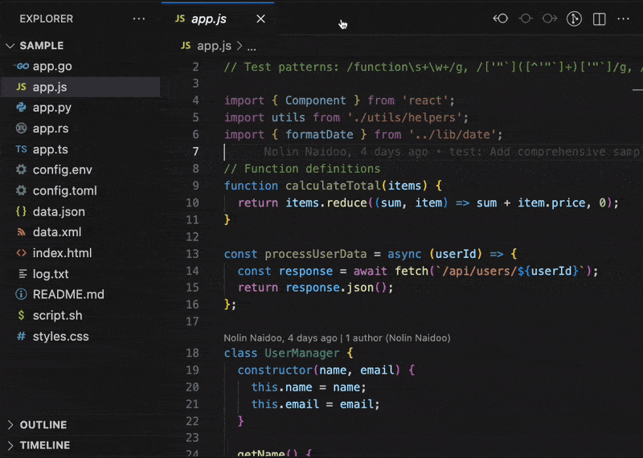

<p align="center">
  
</p>
<h1 align="center">Regex-LE: Zero Hassle Regex Extraction & Validation</h1>
<p align="center">
  <b>Test, extract, and validate regular expressions directly inside VS Code</b><br/>
  <i>Automatic pattern detection • Performance scoring • Built-in ReDoS detection</i>
</p>

<p align="center">
  <a href="https://open-vsx.org/extension/OffensiveEdge/regex-le">
    
  </a>
  <a href="https://marketplace.visualstudio.com/items?itemName=nolindnaidoo.regex-le">
    
  </a>
</p>

<p align="center">
  
  
  
  
</p>

---

<p align="center">
  
</p>

---

## ⚡ See It In Action

**Before**: Manually finding and testing regex patterns (10+ minutes)

```javascript
const pattern1 = /\d+/g;
const pattern2 = new RegExp("\\w+", "i");
// ... searching through files to find all regex patterns
```

**After**: One command extracts all patterns automatically

```
/\d+/g
/\w+/i
/[a-z]+/g
... (12 patterns total)
```

---

## ✅ Why Regex-LE?

- **Automatic pattern extraction** - Finds all regex patterns in your code automatically
- **Zero Config** - Install → Press Extract → Done
- **ReDoS Protection** - Built-in vulnerability detection before execution
- **Performance Scoring** - Get metrics and optimization recommendations

Perfect for testing patterns, extracting data, and validating regex security.

---

## 🙏 Thank You

If Regex-LE saves you time, a quick rating helps other developers discover it:  
⭐ [Open VSX](https://open-vsx.org/extension/OffensiveEdge/regex-le) • [VS Code Marketplace](https://marketplace.visualstudio.com/items?itemName=nolindnaidoo.regex-le)

---

### Key Features

- **Extract Regex Patterns** - Automatically finds all regex patterns in your file (no prompts!)
- **Test Patterns** - Test extracted patterns against file content with detailed results
- **Validate Patterns** - Validate all patterns and detect ReDoS vulnerabilities automatically
- **Performance Scoring** - Get metrics and optimization suggestions
- **ReDoS Detection** - Protection against Regular Expression Denial of Service
- **Universal Support** - Works on any text file format
- **13 languages** - English, Chinese, German, Spanish, French, Indonesian, Italian, Japanese, Korean, Portuguese, Russian, Ukrainian, Vietnamese

## 🚀 More from the LE Family

- **[Paths-LE](https://open-vsx.org/extension/OffensiveEdge/paths-le)** - Extract file paths from code and configs • [VS Code Marketplace](https://marketplace.visualstudio.com/items?itemName=nolindnaidoo.paths-le)
- **[Secrets-LE](https://open-vsx.org/extension/OffensiveEdge/secrets-le)** - Detect API keys, tokens, and credentials • [VS Code Marketplace](https://marketplace.visualstudio.com/items?itemName=nolindnaidoo.secrets-le)
- **[String-LE](https://open-vsx.org/extension/OffensiveEdge/string-le)** - Extract user-visible strings for i18n • [VS Code Marketplace](https://marketplace.visualstudio.com/items?itemName=nolindnaidoo.string-le)
- **[Numbers-LE](https://open-vsx.org/extension/OffensiveEdge/numbers-le)** - Extract and analyze numeric data • [VS Code Marketplace](https://marketplace.visualstudio.com/items?itemName=nolindnaidoo.numbers-le)
- **[URLs-LE](https://open-vsx.org/extension/OffensiveEdge/urls-le)** - Audit API endpoints and external resources • [VS Code Marketplace](https://marketplace.visualstudio.com/items?itemName=nolindnaidoo.urls-le)
- **[Colors-LE](https://open-vsx.org/extension/OffensiveEdge/colors-le)** - Extract and analyze colors from stylesheets • [VS Code Marketplace](https://marketplace.visualstudio.com/items?itemName=nolindnaidoo.colors-le)
- **[Dates-LE](https://open-vsx.org/extension/OffensiveEdge/dates-le)** - Extract temporal data from logs and APIs • [VS Code Marketplace](https://marketplace.visualstudio.com/items?itemName=nolindnaidoo.dates-le)

## 💡 Use Cases

- **Pattern Discovery** - Find all regex patterns in your codebase automatically
- **Pattern Testing** - Test extracted patterns against file content with detailed results
- **Security Validation** - Detect ReDoS vulnerabilities before deployment
- **Performance Optimization** - Get actionable recommendations for slow patterns

### Extracting Regex Patterns

Automatically find all regex patterns in your code:

```javascript
// Your file contains:
const pattern1 = /\d+/g;
const pattern2 = new RegExp('\\w+', 'i');
const pattern3 = /[a-z]+/gm;

// Extract command finds them all automatically:
/\d+/g
/\w+/i
/[a-z]+/gm
```

---

### Testing Patterns

Test extracted patterns against your file content:

```javascript
// Extracted pattern: /\d+/g
// Test against: "Call 555-123-4567 or 555-987-6543"
// Results: 2 matches found (555-123-4567, 555-987-6543)
// Performance: Excellent (95/100)
```

---

### Validating Patterns

Automatically validate all patterns in your file:

```javascript
// Your file contains:
const valid = /\d+/g; // ✅ Valid, no ReDoS
const vulnerable = /(a+)+b/; // ⚠️ Valid but ReDoS vulnerable

// Validate command checks all:
// Pattern 1: ✅ Valid, No ReDoS
// Pattern 2: ✅ Valid, ⚠️ ReDoS: Critical - Nested quantifiers
```

---

## 🚀 Quick Start

1. Install from [Open VSX](https://open-vsx.org/extension/OffensiveEdge/regex-le) or [VS Code Marketplace](https://marketplace.visualstudio.com/items?itemName=nolindnaidoo.regex-le)
2. Open any file with regex patterns (JavaScript, Python, or any text file)
3. Run `Regex-LE: Extract Matches` to see all patterns in your file
4. Use `Test Regex` or `Validate Regex` to test/validate the extracted patterns

## 📋 Available Commands

Regex-LE provides **5 commands** accessible via Command Palette (`Ctrl+Shift+P` / `Cmd+Shift+P`):

### Core Commands

- **Extract Matches** - Automatically extracts all regex patterns from current document (no prompts!)
- **Test Regex** (`Cmd/Ctrl+Alt+R`) - Test extracted patterns against file content with detailed results
- **Validate Pattern** - Validates all extracted patterns and checks for ReDoS vulnerabilities

### Settings & Help

- **Open Settings** - Quick access to extension settings
- **Help & Troubleshooting** - Comprehensive in-editor documentation

## ⚙️ Configuration

Regex-LE has minimal configuration to keep things simple. Most settings are available in VS Code's settings UI under "Regex-LE".

Key settings include:

- ReDoS detection enabled/disabled
- Performance scoring enabled/disabled
- Maximum match limits
- Output format preferences (side-by-side, clipboard copy)
- Safety warnings and thresholds
- Notification levels (silent, important, all)

For the complete list of available settings, open VS Code Settings and search for "regex-le".

## 📁 Supported File Types

**Regex-LE works universally on any text file!** Unlike format-specific extractors that require parsers, regex operates directly on text content.

| Category          | File Types                                                                          |
| ----------------- | ----------------------------------------------------------------------------------- |
| **Programming**   | JavaScript, TypeScript, Python, Ruby, Go, Rust, Java, C/C++, C#, PHP, Swift, Kotlin |
| **Data Formats**  | JSON, YAML, TOML, XML, CSV                                                          |
| **Web**           | HTML, CSS, SCSS, LESS, Sass                                                         |
| **Config**        | .env, .ini, .cfg, .conf                                                             |
| **Documentation** | Markdown, Plain Text, Log Files                                                     |
| **Shell**         | Bash, Zsh, PowerShell, Batch                                                        |

### What Gets Extracted

Regex-LE automatically detects patterns in these formats:

- **Literal regex**: `/pattern/flags` (e.g., `/\d+/g`, `/[a-z]+/i`)
- **RegExp constructor**: `new RegExp('pattern', 'flags')`
- **RegExp calls**: `RegExp('pattern', 'flags')`

All patterns are extracted automatically—no manual input required!

### Smart Features

- **Binary file detection** - Automatically blocks processing of binary files
- **Size limits** - Warns before processing very large files
- **ReDoS detection** - Warns about vulnerable patterns
- **Match limits** - Prevents excessive memory usage
- **Automatic deduplication** - Same pattern with same flags shown only once

---

## 🌍 Language Support

**13 languages**: English, German, Spanish, French, Indonesian, Italian, Japanese, Korean, Portuguese (Brazil), Russian, Ukrainian, Vietnamese, Chinese (Simplified)

## 🧩 System Requirements

**VS Code** 1.70.0+ • **Platform** Windows, macOS, Linux  
**Memory** 200MB recommended for large files

## 🔒 Privacy

100% local processing. No data leaves your machine. Optional logging: `regex-le.telemetryEnabled`

## ⚡ Performance

Regex-LE includes built-in performance monitoring and configurable thresholds to help track operation speed and resource usage.

## 🔧 Troubleshooting

**No patterns found?**  
Ensure your file contains regex patterns in formats like `/pattern/flags` or `new RegExp()`

**Pattern not matching?**  
Check flags (global, case-insensitive, multiline) and test with simpler patterns first

**ReDoS warnings?**  
Review pattern for nested quantifiers or overlapping alternations

**Need help?**  
Check [Issues](https://github.com/OffensiveEdge/regex-le/issues) or enable logging: `regex-le.telemetryEnabled: true`

## ❓ FAQ

**What patterns are extracted?**  
Literal regex (`/pattern/flags`), `new RegExp()` calls, and `RegExp()` function calls

**Does it work on large files?**  
Yes, with automatic safety checks and warnings for files over 1MB

**Is ReDoS detection accurate?**  
It catches common patterns but isn't exhaustive. Always test with realistic data

**Can I test custom patterns?**  
Yes! If no patterns are found in the file, Test/Validate commands will prompt you to enter a pattern manually

**How does Extract work?**  
It automatically scans your file and finds all regex patterns—no prompts, no configuration needed

## 📊 Testing

**81 unit tests across 5 test files** • Powered by Vitest • Run with `bun run test:coverage`

### Test Suite Highlights

- **Comprehensive regex validation** with edge case coverage
- **ReDoS detection tests** for common vulnerability patterns
- **Performance scoring** validation
- **Pattern extraction** tests for all supported formats
- **Error handling** with graceful degradation
- **Configuration and settings** validation

---

Copyright © 2025
<a href="https://github.com/OffensiveEdge">@OffensiveEdge</a>. All rights reserved.
